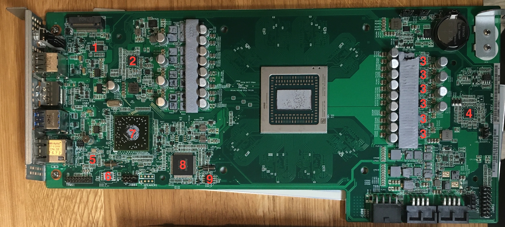

# Connectors

This list of connectors proceeds around the board clockwise from the M.2 header. Pin 1 is generally indicated on the PCB by a little white silkscreen triangle, replicated here with a `>` or `^` symbol.

## M2_1

This M-keyed M.2 slot is wired for two lanes of PCIe 2.0 or a SATA III connection.

## AUTO_PWRON1

```
> [ 1 2 3 ]
```

Jump pins 1 and 2 for the BC-250 to boot automatically when power is applied. (default)\
Jump pins 2 and 3 for the BC-250 to wait for you to press the power button.

## CLRCMOS1

```
> [ 1 2 3]
```

Jump pins 1 and 2 to power the CMOS circuit from the CR2032 CMOS battery. (default)\
Jump pins 2 and 3 to depower the circuit and clear your CMOS settings.

## I2C_HEADER1

```
> [ SCL SDA GND ]
```

The SCL pin is on the "lower" side of the board, closer to the power connectors.

This exposes an I2C interface which appears to host PMBUS communications to the Intersil PMICs.

## J4003

```
[ GND F1T F2T F3T F4T F5T DET     ]
[ GND F1P F2P F3P F4P F5P GND GND ]
   ^
```

This 2.54mm-pitch connector is intended to connect to the power distribution board in the rackmount chassis and control the five 80mm screamer fans. 

| Pin | Purpose |
|-----|---------|
| `F1T` | Fan 1 (`CPU_FAN1`) Tachometer signal |
| `F1P` | Fan 1 PWM control input |
| `FnT` | Fan `n` Tachometer |
| `FnP` | Fan `n` PWM control |
| `DET` | Grounded if connected to the power distribution board |
| `GND` | Ground |

Fan 1's signals correspond to the tachometer and PWM pins on the `CPU_FAN1` connector.

It does not appear to be necessary to ground the `DET` pin in order to run the other fans, but do note that the fan curve in BIOS appears to apply to all the fans equally.

The fan numberings in the pinout above match the Monitor screen in BIOS, but the NCT6686 kernel module in Linux numbers them differently:

| BIOS Fan Number | Linux Fan Number |
|---|---|
| 1 | 2 |
| 2 | 3 |
| 3 | 4 |
| 4 | 5 |
| 5 | 1 |

## CPU_FAN1

```
[ PWM Tach 12V GND ]
                ^
```

This is a normal four-pin PWM-capable fan header.

## J2000 and J2001

As viewed with the PCB "down"
```
   v                     v
[ LED1 12V 12V 12V ]  [ 12V 12V 12V GND ]
[ LED2 GND GND GND ]  [ GND GND GND PGD ]
```

| Pin | Purpose |
|--------|---------|
| `PGD`  | `PGOOD`; 5V when PSU2 is connected to the rack chassis |
| `LED1` | Active-low LED output; mirrors green backplane LED |
| `LED2` | Active-low LED output; mirrors red backplane LED |

These connectors are manufactured by ALLTOP but are directly interchangeable with the [444280801](https://www.molex.com/en-us/products/part-detail/444280801) Molex Micro-Fit BMI headers.

They should be able to mate with J2000 and J2001 appear to be ALLTOP connectors that are interchangeable with the Molex Micro-Fit BMI [444280801](https://www.molex.com/en-us/products/part-detail/444280801).

The mating connectors on the rack chassis' power distribution board appear to be taller versions of the [447690801](https://www.molex.com/en-us/products/part-detail/447690801) receptacle header.

If you decide to power the BC-250 from these connectors, I recommend using both J2000 and J2001 for redundancy.

## J1000

```
[ GND GND GND GND ]
[ 12V 12V 12V GND ]
```

This is a standard 8-pin PCIe connector and is perfectly suitable for powering a BC-250.

## J4004

```
[ GND SCLK MOSI UNK ]
[ VCC  CS  MISO     ]
   ^
```

This 2.54mm header can be used to reflash the SPI flash chip which carries the firmware ("BIOS").

The function of pin `UNK` is unknown, but it is tied to ground via a 10kOhm resistor.

## TPMS1

```
 PCICLK -- [  1   2 ] -- GND
  FRAME -- [  3   4 ] -- SMB_CLK_MAIN
PCIRST# -- [  5   6 ] -- SMB_DATA_MAIN
   LAD3 -- [  7   8 ] -- LAD2
     3V -- [  9  10 ] -- LAD1
   LAD0 -- [ 11  12 ] -- GND
           [     14 ] -- S_PWRDWN#
   3VSB -- [ 15  16 ] -- SERIRQ#
    GND -- [ 17  18 ] -- GND
```

This is a relatively standard 18-pin 2.0mm pitch Asrock TPMS/LPC header.

If you want to monitor LPC transactions at boot, the following pins need to be connected. Note that LPC is clocked relative to `PCICLK`, which runs at 33MHz.

```
  [ GND    -     - LAD2 LAD1 -    - - - ]
> [ PCICLK FRAME - LAD3 -    LAD0   - - ]
```

## J2

On the bottom of the board is an unpopulated 20-pin 1.27mm pitch footprint. This is an [AMD HDT+ debug connector](https://github.com/x86-JTAG-Open-Research/x86-JTAG-Information/blob/master/Connector/HDTPlus.md), used for JTAG debugging.

```
 VDDIO -- [  1   2 ] -- TCK
   GND -- [  3   4 ] -- TMS
   GND -- [  5   6 ] -- TDI
   GND -- [  7   8 ] -- TDO
TRST_L -- [  9  10 ] -- PWROK_BUF
DBRDY3 -- [ 11  12 ] -- RESET_L
DBRDY2 -- [ 13  14 ] -- DBRDY0
DBRDY1 -- [ 15  16 ] -- DBREQ_L
   GND -- [ 17  18 ] -- TEST19
 VDDIO -- [ 19  20 ] -- TEST18
```

Note that pins `TEST18`, `TEST19`, `DBRDY0` are left floating on this PCB.

# Auxiliary Chip ID



| Number | Designator | Chip | Description |
|---|--------------|---------------------|-|
| 1 | `M2U2`       | NXP CBTL04083B      | 2:1 PCIe x4 Multiplexer |
| 2 | `PUIO1`      | Intersil ISL95712   | Core supply PMIC |
| 3 | `PUA11`, etc | Intersil ISL99360   | Smart Power Stage (phase controller) |
| 4 | `PUA1`       | Intersil ISL69247   | Main PMIC |
| 5 | `U30`        | Realtek RTL8111H    | Ethernet NIC (PCIe x1) |
| 6 | `BIOS_A1`    | Winbond 25Q168JVSQ  | 16MiB SPI flash (BIOS) |
| 7 | `SU1`        | AMD 218-0844029     | A68H Bolton-D2H FCH chipset |
| 8 | `UIO1`       | Nuvoton NCT6686D    | SuperIO controller |
| 9 | `SIO1_R`     | Macronix MX25L4006E | 512kiB SPI flash (SuperIO program flash) |

Some jellybean MOSFETs and voltage regulators have been omitted.
